# NORTi を RX Smartconfigurator と一緒に使う方法

<br />

かふぇルネから飛んでこられた方。こんにちは、ふぐりんです。  
このドキュメントは「NORTi を RX Smartconfigurator と一緒に使う方法」の解説です。  

**NoMaYさん考案のプログラムによって、NORTiとスマートコンフィグレータを一緒に使うことができるようになりました。スマートコンフィグレータ(FIT/CG)の自動生成コードは何も改変せずに、ユーザコードエリアやコールバックからNORTiの機能を使えます。またNORTi方式の割り込みもそのまま併用できます。**

経緯については以下のかふぇルネのスレッドをご覧ください。  

* [スマートコンフィグレータの自動生成をカスタマイズしたい](https://community-ja.renesas.com/cafe_rene/f/forum5/8248/thread)
* [MISPOさんのNORTiをRX SmartConfiguratorと一緒に使いたい場合の課題と対策を考察してみるスレッド](https://community-ja.renesas.com/cafe_rene/f/forum21/8266/mispo-norti-rx-smartconfigurator)

<sub>【謝辞】  
NoMaYさんが考案したプログラムを中心に解説しています。NoMaYさんにあらためてお礼申し上げます。  
株式会社ミスポ様には関連コードの公開を許諾いただきました。ありがとうございました。お礼申し上げます。  
ka.makiharaさんにはNoMaYさんのプログラム作成に協力いただき、また実証実験もしていただきました。ありがとうございました。お礼申し上げます。  
【お願い】  
ミスポ様にご協力いただいた情報を参考にしていますが、NoMaYさんのプログラムおよび今回の解説にミスポ様は直接関係されていません。NoMaYさんのプログラムおよび今回の解説について直接ミスポ様へ問い合わせすることはおやめください。  
【ご利用について】  
ここで解説されている情報は商用/非商用にかかわらずご利用いただけますが、何も保証しません。
</sub>

<br /><br /><br />

## 動作の解説
[**動作の解説**](README_exp.md)

<br /><br /><br />

## セットアップ

1. RXシリーズの開発環境(CS+,CC-RX)でプロジェクトを作ります
2. プロジェクトにNoMaYさんの下記プログラムを追加します

* [NORTi_interrupt.c](code/NORTi_interrupt.c)
* [NORTi_interrupt.h](code/NORTi_interrupt.h)

3. NORTiを組み込みます
4. NORTiのintini()の "initialize interrupt vector table" 部分を以下と入れ替えます

```c
    /* initialize interrupt vector table (on RAM) */
#if (INTVSZ != 0)                               // NORTi管理の割込みベクタテーブルがRAMであれば普通は1024
    extern void NORTi_INT_HOOK_init(void);      // Int_Hook_Vectors[]をINTBレジスタにセット(NoMaYさん作成)
    NORTi_INT_HOOK_init();                      // 
    {
        int i;
        UW *vect = (UW *)__sectop("C$VECT");    // C$VECTセクション(CC-RXオリジナルの割り込みベクタテーブル)
        UW *hook = (UW *)get_intb();            // NORTi対応割り込みベクタテーブル(NoMaYさん作成,Int_Hook_Vectors[])
        for (i = 0; i < INTVSZ / 4; i++) {      // 割込みベクタテーブル(NORTi管理,RAM)全体にコピー
            intvec[i] = (i<16)?vect[i]:hook[i]; // 0～15は無条件トラップ専用なのでC$VECT、それ以外はInt_Hook_Vectors[]
        }
    }
#endif
```

上記でセットアップは完了です。  

<br /><br /><br />

## 効果

### 1. FIT/CGは改変なしでそのままNORTiを利用できます。

ユーザコードエリアやコールバックでNORTiを利用できます。

### 2. NORTiの割込みハンドラ(def_inh())をそのまま利用できます。

### 3. NORTiの割込みサービスルーチン(cre_isr())をそのまま利用できます。（最初におまじない必要）

割込みサービスルーチン(cre_isr())を使う前に、1回だけ def_inh(割り込み番号, NULL) をしてください。NULLを指定することで、その割込み番号だけNoMaYさんのInt_Hook_Vectors[]の代わりにNORTiの管理用ルーチンがセットされます。

### 4. FIT/CGの割込み処理はNORTi対応で少しオーバヘッドが増えますが、NORTiを使わないで高速に処理したい場合(nonOS)はdef_inh()で対応できます。(割り込みレベル注意)

### 【注意】INT/BRK(ベクタ番号0～15)と例外ベクタテーブルの割り込みはNORTi非対応です。
### 【注意２】BUSERR(ベクタ番号16)の割り込みはNORTi非対応です。(2022.12.23 追記)

<br /><br /><br />

## 実験(Target Board for RX130,CS+)

### 使用ツールと実験プログラムについて

* [統合開発環境 CS+](https://www.renesas.com/jp/ja/software-tool/cs)
* [CC-RXコンパイラ](https://www.renesas.com/jp/ja/software-tool/cc-compiler-package-rx-family)
* [NORTi Professional](http://www.mispo.co.jp/products/NORTi/Pro/)
* [Target Board for RX130](https://www.renesas.com/jp/ja/products/microcontrollers-microprocessors/rx-32-bit-performance-efficiency-mcus/rtk5rx1300c00000br-target-board-rx130)
* [GG for CC-RX(EMU)](https://github.com/mkogax/GG_for_CCRX)

Target Board for RX130 に内蔵されたE2Lite相当エミュレータを経由したデバッグコンソールでGGコンソール機能(GG for CC-RX)を使います。  
NORTiタスクの状態表示/起動終了制御などを行うコマンドを実装しました。  

```text
** GG for CCRX **
tskpri=1
>task
tid= 1 taskg      RUN  pri= 1 stack=00000820(size= 1024)
tid= 2 task1      DMT  pri= 8 stack=00000C20(size=  256)
tid= 3 task2      DMT  pri= 8 stack=00000D20(size=  256)
tid= 4 task3      DMT  pri= 8 stack=00000E20(size=  256)
tid= 5 task4      DMT  pri= 8 stack=00000F20(size=  256)
>task ?
(usage)
task                       タスク一覧(状態表示)
task act <tid>             act_tsk(tid)
task cana <tid>            can_act(tid)
task sta <tid> [<stacd>]   sta_tsk(tid,stacd)
task ter <tid>             ter_tsk(tid)
task chg <tid> <tskpri>    chg_pri(tid,tskpri)
task ref <tid>             ref_tsk(tid,&rtsk)
task sus <tid>             sus_tsk(tid)
task rsm <tid>             rsm_tsk(tid)
task frsm <tid>            frsm_tsk(tid)
task wup <tid>             wup_tsk(tid)
task canw <tid>            can_wup(tid)
task rel <tid>             rel_wai(tid)
(tidは数値でもタスク名でも可)
>help
        help [cmd..]                  : command help
-- memory command --
          md [addr [alen]]            : mem dump
          ms addr data..              : mem set
          mf addr alen data           : mem fill
-- Example of original command registration --
       test1 [...]                    : Display command line arguments when executing this command
        task [...]                    : Display and control task status
         cmt                          : CMT(FITモジュール) NORTi用タイマ設定状態表示
-- TP command --
          tp [#1 [#2]]                : TP(test point) select
>
```

またTP機能で状態変化タイミングをオシロで観測しました。

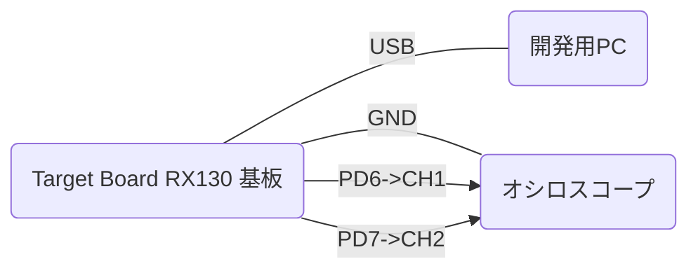

実験時のプログラムソース(参考)

* [GG_NORTi.c](code/GG_NORTi.c)  メインプログラム
* [GG_NORTi_task.c](code/GG_NORTi_task.c)  タスク制御（GGコンソール用コマンド)
* [gg_sysdef.h](code/gg_sysdef.h)  GGコンソール設定(TP機能)

<br /><br />

### 実験１．r_cmt_rx(FIT)の10msec周期コールバックからNORTiのチックタイム通知(isig_tim())

```c
void main(void)
{
    GG_DI_ON();     // 割込み禁止

    sysini();       // NORTi初期化

    // CMT(FITモジュール) タイマ設定(10msec周期割込み)
    R_CMT_CreatePeriodic(100, cmt_10msec_callback, &cmt_10msec_ch);

```

```text
>tp 900 30
<TP status number(The specified status number appears in TP)>
TP1 = 900 (-1=do nothing)
TP2 =  30 (-1=do nothing)
>
```

上 TP1=900(cmt_10msec_callback()処理)  
下 TP2=30(taskgタスクのメインループの10msec待ちの「出口」)  

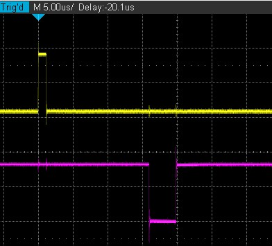

約10msec周期でisig_tim()から約15usec後に10msec待ちが解除されています。  
(オシロの時間軸を長くして10msec周期である確認もしています)

<br /><br />

### 実験２．TMR0(CG)で#pragma interrupt の割込みルーチンからタスク起床(wup_tsk())

```c
(Config_TMR0_user.c)

#if FAST_INTERRUPT_VECTOR == VECT_TMR0_CMIA0
#pragma interrupt r_Config_TMR0_cmia0_interrupt(vect=VECT(TMR0,CMIA0),fint)
#else
#pragma interrupt r_Config_TMR0_cmia0_interrupt(vect=VECT(TMR0,CMIA0))
#endif
static void r_Config_TMR0_cmia0_interrupt(void)
{
    /* Start user code for r_Config_TMR0_cmia0_interrupt. Do not edit comment generated here */
    extern void task1_TMR0_callback(void);
    task1_TMR0_callback();
    /* End user code. Do not edit comment generated here */
}
```

```text
>task sta task1
sta_tsk(2,0) = 0
>
** task1 ** stacd=0, tskpri=8
#pragma interruptによるFIT/CG割り込みルーチンの実験--
R_Config_TMR0_Start()
>task
tid= 1 taskg      RUN  pri= 1 stack=00000820(size= 1024)
tid= 2 task1      RDY  pri= 8 stack=00000C20(size=  256)
tid= 3 task2      DMT  pri= 8 stack=00000D20(size=  256)
tid= 4 task3      DMT  pri= 8 stack=00000E20(size=  256)
tid= 5 task4      DMT  pri= 8 stack=00000F20(size=  256)
>tp 101 100
<TP status number(The specified status number appears in TP)>
TP1 = 101 (-1=do nothing)
TP2 = 100 (-1=do nothing)
>
```

上 TP1=101(task1_TMR0_callback()処理)  
下 TP2=100(task1タスクのメインループでslp_tsk()から抜けるとパルス)  

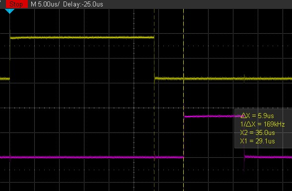

task1_TMR0_callback()処理はタスク名文字列でタスクIDの検索をしているので時間がかかっているようです。(約30usec)  
wup_tsk()から5.9usec後にslp_tsk()が解除されています。  

<br /><br />

### 実験３．TMR1(CG)の改造でdef_inh() のNORTi割込みハンドラからタスク起床(wup_tsk())

```c
(Config_TMR1_user.c)

#if FAST_INTERRUPT_VECTOR == VECT_TMR1_CMIA1
#pragma interrupt r_Config_TMR1_cmia1_interrupt(vect=VECT(TMR1,CMIA1),fint)
#else
#pragma interrupt r_Config_TMR1_cmia1_interrupt(vect=VECT(TMR1,CMIA1))
#endif
static void r_Config_TMR1_cmia1_interrupt(void)
{
    /* Start user code for r_Config_TMR1_cmia1_interrupt. Do not edit comment generated here */
    /* End user code. Do not edit comment generated here */
}

/* Start user code for adding. Do not edit comment generated here */
#include "kernel.h"
static void NORTi_r_Config_TMR1_cmia1_interrupt(void)
{
    ent_int();                                  /* enter into interrupt handler */
    extern void task2_TMR1_callback(void);
    task2_TMR1_callback();                      /* call interrupt handler body */
    ret_int();                                  /* return from interrupt handler */
}
void norti_TMR1_def_inh(void)   // TMR1の割込み処理の登録(def_inh())
{
    static T_DINH dinh = { TA_HLNG, NORTi_r_Config_TMR1_cmia1_interrupt, 6 }; // とりあえず割込レベルは６(たぶんこの割込レベルは使ってない)
    def_inh(VECT(TMR1,CMIA1), &dinh);
}
/* End user code. Do not edit comment generated here */
```
r_Config_TMR1_cmia1_interrupt()は使いません。

```text
>task sta task2
sta_tsk(3,0) = 0
>
** task2 ** stacd=0, tskpri=8
def_inh()によるNORTi標準割り込みルーチンの実験--
norti_TMR1_def_inh()
R_Config_TMR1_Start()

>tp 201 200
<TP status number(The specified status number appears in TP)>
TP1 = 201 (-1=do nothing)
TP2 = 200 (-1=do nothing)
>
```

上 TP1=201(task2_TMR1_callback()処理)  
下 TP2=200(task2タスクのメインループでslp_tsk()から抜けるとパルス)  

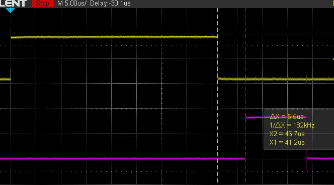

task2_TMR1_callback()処理もタスク名文字列でタスクIDの検索をしているので時間がかかっているようです。(約40usec)  
wup_tsk()から5.5usec後にslp_tsk()が解除されています。  

<br /><br />

### 実験４．TMR2(CG)の改造でcre_isr() のNORTi割込みサービスルーチンからタスク起床(wup_tsk())

```c
(Config_TMR2_user.c)

#if FAST_INTERRUPT_VECTOR == VECT_TMR2_CMIA2
#pragma interrupt r_Config_TMR2_cmia2_interrupt(vect=VECT(TMR2,CMIA2),fint)
#else
#pragma interrupt r_Config_TMR2_cmia2_interrupt(vect=VECT(TMR2,CMIA2))
#endif
static void r_Config_TMR2_cmia2_interrupt(void)
{
    /* Start user code for r_Config_TMR2_cmia2_interrupt. Do not edit comment generated here */
    /* End user code. Do not edit comment generated here */
}

/* Start user code for adding. Do not edit comment generated here */
#include "kernel.h"
void norti_TMR2_cre_isr(void)      // TMR2の割込みサービスルーチンの登録(cre_isr())
{
    extern void task3_TMR2_callback(void);
    extern void task3_TMR2_callback2(void);
    static T_CISR cisr = { TA_HLNG, NULL, VECT(TMR2,CMIA2), task3_TMR2_callback, 6}; // とりあえず割込レベルは６(たぶんこの割込レベルは使ってない)
    static T_CISR cisr2= { TA_HLNG, NULL, VECT(TMR2,CMIA2), task3_TMR2_callback2, 6}; // とりあえず割込レベルは６(たぶんこの割込レベルは使ってない)
    def_inh(VECT(TMR2,CMIA2), NULL);    // 登録をデフォルトに再設定(_kernel_interr())  --> これでcre_isrが使える
    cre_isr(0, &cisr);                  // 割込みサービスルーチンの登録
    cre_isr(0, &cisr2);                 // 割込みサービスルーチンの登録2(多重できるか？)
}
/* End user code. Do not edit comment generated here */
```

r_Config_TMR2_cmia2_interrupt()は使いません。

```text
>task sta task3
sta_tsk(4,0) = 0
>
** task3 ** stacd=0, tskpri=8
cre_isr()によるNORTi標準割り込みサービスルーチンの実験--
norti_TMR2_cre_isr()
R_Config_TMR2_Start()

>tp 301 302
<TP status number(The specified status number appears in TP)>
TP1 = 301 (-1=do nothing)
TP2 = 302 (-1=do nothing)
>
```

上 TP1=301(task3_TMR2_callback()処理)  
下 TP2=302(task3_TMR2_callback2()処理)  

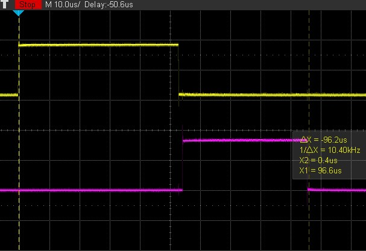

1回の割り込みで2つのサービスルーチンがコールされるようセットしています。
task3_TMR2_callback()処理は約50usec、task3_TMR2_callback2()処理は約40usecかかっています。検索タスク名の違いが処理時間に関係していることが分かります。  
task3_TMR2_callback()処理はtask3をwup_tsk()し、task3_TMR2_callback2()処理はtask2をwup_tsk()します。

```text
>tp 301 300
<TP status number(The specified status number appears in TP)>
TP1 = 301 (-1=do nothing)
TP2 = 300 (-1=do nothing)
```

上 TP1=301(task3_TMR2_callback()処理 task3をwup_tsk())  
下 TP2=300(task3タスクのメインループでslp_tsk()から抜けるとパルス)  

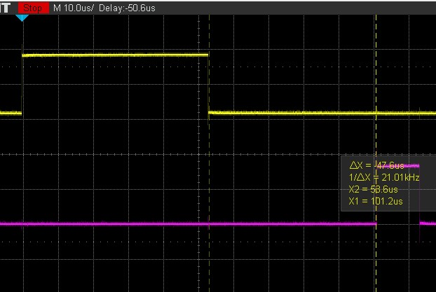

task3_TMR2_callback2()処理のぶん遅れるので、wup_tsk()から47.6usec後にslp_tsk()が解除されています。  

```text
>tp 302 200
<TP status number(The specified status number appears in TP)>
TP1 = 302 (-1=do nothing)
TP2 = 200 (-1=do nothing)
```

上 TP1=302(task3_TMR2_callback2()処理 task2をwup_tsk())  
下 TP2=200(task2タスクのメインループでslp_tsk()から抜けるとパルス)  

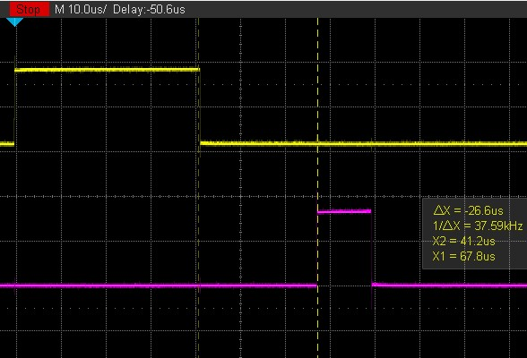

task3_TMR2_callback2()処理のwup_tsk()から26.6usec後にslp_tsk()が解除されています。この遅れ時間は、その直前にtask3のslp_tsk()が先に解除されふたたびtask3がslp_tsk()になるまで待たされたためだと思われます。

```text
>tp 300 200
<TP status number(The specified status number appears in TP)>
TP1 = 300 (-1=do nothing)
TP2 = 200 (-1=do nothing)
```

上 TP1=300(task3タスクのメインループでslp_tsk()から抜けるとパルス)  
下 TP2=200(task2タスクのメインループでslp_tsk()から抜けるとパルス)  

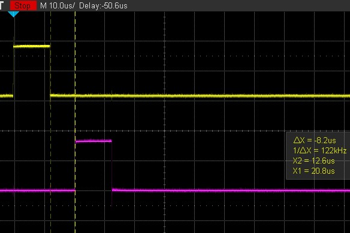

確認してみると、やはりtask3のslp_tsk()が解除されふたたびtask3がslp_tsk()になってから8.2usec後にtask2のslp_tsk()が解除されています。

<br /><br />

### 実験５．TMR3(CG)で#pragma interrupt の割込みルーチンを非NORTiとして再登録(def_inh())してカウンタ変数更新を確認

```c
(Config_TMR3_user.c)

#if FAST_INTERRUPT_VECTOR == VECT_TMR3_CMIA3
#pragma interrupt r_Config_TMR3_cmia3_interrupt(vect=VECT(TMR3,CMIA3),fint)
#else
#pragma interrupt r_Config_TMR3_cmia3_interrupt(vect=VECT(TMR3,CMIA3))
#endif
static void r_Config_TMR3_cmia3_interrupt(void)
{
    /* Start user code for r_Config_TMR3_cmia3_interrupt. Do not edit comment generated here */
    extern void task4_TMR3_callback(void);  // NORTi非対応
    task4_TMR3_callback();  // NORTi非対応
    /* End user code. Do not edit comment generated here */
}

/* Start user code for adding. Do not edit comment generated here */
#include "kernel.h"
void nonOS_TMR3_def_inh(void)      // TMR2の非NORTi割込みの登録(def_inh())
{
    static T_DINH dinh = { TA_HLNG, r_Config_TMR3_cmia3_interrupt, 6 }; // とりあえず割込レベルは６(たぶんこの割込レベルは使ってない)
    def_inh(VECT(TMR3,CMIA3), &dinh);
}
/* End user code. Do not edit comment generated here */
```

r_Config_TMR3_cmia3_interrupt()はdef_inh()で再登録して使っています。  
def_inh()で登録すると、INTBレジスタの示す割込みベクタテーブルに直接登録されるのでNORTi対応用の入口出口関数(ent_int()/ret_int())を通りません。そのぶんのオーバヘッドがなくなりますが、r_Config_TMR3_cmia3_interrupt()の中やコールバックでNORTi(API)はコールできません。

```text
>task sta task4
sta_tsk(5,0) = 0
>
** task4 ** stacd=0, tskpri=8
非NORTi割り込みによるコールバックの実験--
nonOS_TMR3_def_inh()
R_Config_TMR3_Start()

>tp 401 400
<TP status number(The specified status number appears in TP)>
TP1 = 401 (-1=do nothing)
TP2 = 400 (-1=do nothing)
>
```

上 TP1=401(task4_TMR3_callback()処理)  
下 TP2=400(task4タスクのメインループでtask4_counterの変化を検出するとパルス)  

https://user-images.githubusercontent.com/11693904/178516010-ede07447-d9a4-41cc-be2b-f0aa140e5023.mp4

task4_TMR3_callback()は8bitタイマを使用してきっちりmsec単位ではありません。一方、task4では10msecごとにtask4_counterをチェックするのでtask4_TMR3_callback()のタイミングと微妙にずれていきます。
動画ではtask4でtask4_counterの変化を検出するタイミングがずれていく様子が分かります。
(下は残像のためか2パルスに見えるときがありますが、本当は1パルスのみです)

<br /><br /><br />

## おまけ１（スタックがぎりぎりやった）

タスクのスタックエリアの使用状況を確認してみます。  
taskg以外は起動前なのでスタックがタスクIDで埋まっています。(下部を除く)  

```text
>task
tid= 1 taskg      RUN  pri= 8 stack=00000820(size= 1024)
tid= 2 task1      DMT  pri= 7 stack=00000C20(size=  256)
tid= 3 task2      DMT  pri= 7 stack=00000D20(size=  256)
tid= 4 task3      DMT  pri= 7 stack=00000E20(size=  256)
tid= 5 task4      DMT  pri= 7 stack=00000F20(size=  256)
>md 0x820 0x400
00000820  01 01 01 01 01 01 01 01  01 01 01 01 01 01 01 01  ........ ........
（中略）
00000A40  01 01 01 01 01 01 01 01  01 01 01 01 01 01 01 01  ........ ........
00000A50  01 01 01 01 01 01 01 01  01 01 01 01 01 01 01 01  ........ ........
00000A60  01 01 01 01 28 16 00 00  2D C0 08 00 2C 16 00 00  ....(... -...,...
00000A70  44 0B 00 00 2B 1A F8 FF  73 00 00 00 2C 1A F8 FF  D...+... s...,...
00000A80  28 16 00 00 C0 40 08 00  00 01 00 00 20 00 00 00  (....@.. .... ...
00000A90  20 00 00 00 00 00 00 00  77 3A F8 FF 00 00 00 00   ....... w:......
00000AA0  00 00 00 00 16 3A F8 FF  05 00 03 00 60 3A F8 FF  .....:.. ....`:..
00000AB0  F8 0A 00 00 60 3A F8 FF  0A 00 00 00 60 3A F8 FF  ....`:.. ....`:..
00000AC0  04 0B 00 00 F8 0A 00 00  25 00 00 00 3D 43 F8 FF  ........ %...=C..
00000AD0  E5 48 F8 FF 05 00 00 00  28 16 00 00 2D C0 08 00  .H...... (...-...
00000AE0  2C 16 00 00 B0 0B 00 00  28 16 00 00 2D C0 08 00  ,....... (...-...
00000AF0  2C 16 00 00 B4 0B 00 00  EB 15 F8 FF EC 15 F8 00  ,....... ........
00000B00  38 00 00 00 38 00 00 00  00 00 08 00 00 01 00 00  8...8... ........
00000B10  20 00 00 00 20 00 00 00  00 00 00 00 77 3A F8 FF   ... ... ....w:..
00000B20  60 3A F8 FF 6C 0B 00 00  7B 0B 00 00 00 00 00 00  `:..l... {.......
00000B30  60 43 F8 FF E0 46 F8 FF  78 0B 00 00 6C 0B 00 00  `C...F.. x...l...
00000B40  3D 00 00 00 5D 48 F8 FF  60 16 00 00 20 14 00 00  =...]H.. `... ...
00000B50  30 03 00 00 5C 16 00 00  BB 0B 00 00 0B 00 00 00  0...\... ........
00000B60  20 00 00 00 ED 15 F8 FF  08 49 F8 FF 77 3A F8 FF   ....... .I..w:..
00000B70  FF FF FF FF 00 00 00 00  02 01 FF 46 34 42 F8 FF  ........ ...F4B..
00000B80  0A 00 00 00 60 3A F8 FF  C4 0B 00 00 B0 00 00 00  ....`:.. ........
00000B90  20 00 00 00 1D 4A F8 FF  38 3F F8 FF 7B 0B 00 00   ....J.. 8?..{...
00000BA0  03 00 01 00 1D 49 F8 FF  80 3F F8 FF ED 15 F8 FF  .....I.. .?......
00000BB0  B0 00 00 00 B0 00 00 00  B0 00 00 00 B0 00 00 00  ........ ........
00000BC0  B0 00 00 00 24 15 00 00  03 00 00 00 01 00 00 00  ....$... ........
00000BD0  2D C0 08 00 00 00 00 00  00 00 00 00 00 00 00 00  -....... ........
00000BE0  00 00 00 00 29 3D F8 FF  0D 00 00 00 20 14 00 00  ....)=.. .... ...
00000BF0  01 00 00 00 2D C0 08 00  13 3C F8 FF 28 16 00 00  ....-... .<..(...
00000C00  2C 16 00 00 9F 34 F8 FF  08 00 00 00 01 01 01 01  ,....4.. ........
00000C10  00 00 00 00 00 00 00 00  00 00 00 00 3B 84 F8 FF  ........ ....;...
>md 0xc20 0x100
00000C20  02 02 02 02 02 02 02 02  02 02 02 02 02 02 02 02  ........ ........
00000C30  02 02 02 02 02 02 02 02  02 02 02 02 02 02 02 02  ........ ........
00000C40  02 02 02 02 02 02 02 02  02 02 02 02 02 02 02 02  ........ ........
00000C50  02 02 02 02 02 02 02 02  02 02 02 02 02 02 02 02  ........ ........
00000C60  02 02 02 02 02 02 02 02  02 02 02 02 02 02 02 02  ........ ........
00000C70  02 02 02 02 02 02 02 02  02 02 02 02 02 02 02 02  ........ ........
00000C80  02 02 02 02 02 02 02 02  02 02 02 02 02 02 02 02  ........ ........
00000C90  02 02 02 02 02 02 02 02  02 02 02 02 02 02 02 02  ........ ........
00000CA0  02 02 02 02 02 02 02 02  02 02 02 02 02 02 02 02  ........ ........
00000CB0  02 02 02 02 02 02 02 02  02 02 02 02 02 02 02 02  ........ ........
00000CC0  02 02 02 02 02 02 02 02  02 02 02 02 02 02 02 02  ........ ........
00000CD0  02 02 02 02 02 02 02 02  00 00 00 00 00 00 00 00  ........ ........
00000CE0  00 00 00 00 00 00 00 00  00 00 00 00 00 00 00 00  ........ ........
00000CF0  00 00 00 00 00 00 00 00  00 00 00 00 00 00 00 00  ........ ........
00000D00  00 00 00 00 00 00 00 00  00 00 00 00 00 00 00 00  ........ ........
00000D10  00 00 00 00 00 00 00 00  00 00 00 00 00 00 00 00  ........ ........
>md 0xd20 0x100
00000D20  03 03 03 03 03 03 03 03  03 03 03 03 03 03 03 03  ........ ........
00000D30  03 03 03 03 03 03 03 03  03 03 03 03 03 03 03 03  ........ ........
00000D40  03 03 03 03 03 03 03 03  03 03 03 03 03 03 03 03  ........ ........
00000D50  03 03 03 03 03 03 03 03  03 03 03 03 03 03 03 03  ........ ........
00000D60  03 03 03 03 03 03 03 03  03 03 03 03 03 03 03 03  ........ ........
00000D70  03 03 03 03 03 03 03 03  03 03 03 03 03 03 03 03  ........ ........
00000D80  03 03 03 03 03 03 03 03  03 03 03 03 03 03 03 03  ........ ........
00000D90  03 03 03 03 03 03 03 03  03 03 03 03 03 03 03 03  ........ ........
00000DA0  03 03 03 03 03 03 03 03  03 03 03 03 03 03 03 03  ........ ........
00000DB0  03 03 03 03 03 03 03 03  03 03 03 03 03 03 03 03  ........ ........
00000DC0  03 03 03 03 03 03 03 03  03 03 03 03 03 03 03 03  ........ ........
00000DD0  03 03 03 03 03 03 03 03  00 00 00 00 00 00 00 00  ........ ........
00000DE0  00 00 00 00 00 00 00 00  00 00 00 00 00 00 00 00  ........ ........
00000DF0  00 00 00 00 00 00 00 00  00 00 00 00 00 00 00 00  ........ ........
00000E00  00 00 00 00 00 00 00 00  00 00 00 00 00 00 00 00  ........ ........
00000E10  00 00 00 00 00 00 00 00  00 00 00 00 00 00 00 00  ........ ........
>md 0xe20 0x100
00000E20  04 04 04 04 04 04 04 04  04 04 04 04 04 04 04 04  ........ ........
00000E30  04 04 04 04 04 04 04 04  04 04 04 04 04 04 04 04  ........ ........
00000E40  04 04 04 04 04 04 04 04  04 04 04 04 04 04 04 04  ........ ........
00000E50  04 04 04 04 04 04 04 04  04 04 04 04 04 04 04 04  ........ ........
00000E60  04 04 04 04 04 04 04 04  04 04 04 04 04 04 04 04  ........ ........
00000E70  04 04 04 04 04 04 04 04  04 04 04 04 04 04 04 04  ........ ........
00000E80  04 04 04 04 04 04 04 04  04 04 04 04 04 04 04 04  ........ ........
00000E90  04 04 04 04 04 04 04 04  04 04 04 04 04 04 04 04  ........ ........
00000EA0  04 04 04 04 04 04 04 04  04 04 04 04 04 04 04 04  ........ ........
00000EB0  04 04 04 04 04 04 04 04  04 04 04 04 04 04 04 04  ........ ........
00000EC0  04 04 04 04 04 04 04 04  04 04 04 04 04 04 04 04  ........ ........
00000ED0  04 04 04 04 04 04 04 04  00 00 00 00 00 00 00 00  ........ ........
00000EE0  00 00 00 00 00 00 00 00  00 00 00 00 00 00 00 00  ........ ........
00000EF0  00 00 00 00 00 00 00 00  00 00 00 00 00 00 00 00  ........ ........
00000F00  00 00 00 00 00 00 00 00  00 00 00 00 00 00 00 00  ........ ........
00000F10  00 00 00 00 00 00 00 00  00 00 00 00 00 00 00 00  ........ ........
>md 0xf20 0x100
00000F20  05 05 05 05 05 05 05 05  05 05 05 05 05 05 05 05  ........ ........
00000F30  05 05 05 05 05 05 05 05  05 05 05 05 05 05 05 05  ........ ........
00000F40  05 05 05 05 05 05 05 05  05 05 05 05 05 05 05 05  ........ ........
00000F50  05 05 05 05 05 05 05 05  05 05 05 05 05 05 05 05  ........ ........
00000F60  05 05 05 05 05 05 05 05  05 05 05 05 05 05 05 05  ........ ........
00000F70  05 05 05 05 05 05 05 05  05 05 05 05 05 05 05 05  ........ ........
00000F80  05 05 05 05 05 05 05 05  05 05 05 05 05 05 05 05  ........ ........
00000F90  05 05 05 05 05 05 05 05  05 05 05 05 05 05 05 05  ........ ........
00000FA0  05 05 05 05 05 05 05 05  05 05 05 05 05 05 05 05  ........ ........
00000FB0  05 05 05 05 05 05 05 05  05 05 05 05 05 05 05 05  ........ ........
00000FC0  05 05 05 05 05 05 05 05  05 05 05 05 05 05 05 05  ........ ........
00000FD0  05 05 05 05 05 05 05 05  00 00 00 00 00 00 00 00  ........ ........
00000FE0  00 00 00 00 00 00 00 00  00 00 00 00 00 00 00 00  ........ ........
00000FF0  00 00 00 00 00 00 00 00  00 00 00 00 00 00 00 00  ........ ........
00001000  00 00 00 00 00 00 00 00  00 00 00 00 00 00 00 00  ........ ........
00001010  00 00 00 00 00 00 00 00  00 00 00 00 00 00 00 00  ........ ........
```

task1～task5を起動してみます。 
けっこうギリギリですね。危なかった・・次ほかの実験するときは増やしときます

```text
>task
tid= 1 taskg      RUN  pri= 8 stack=00000820(size= 1024)
tid= 2 task1      WAIT pri= 7 stack=00000C20(size=  256)
tid= 3 task2      WAIT pri= 7 stack=00000D20(size=  256)
tid= 4 task3      WAIT pri= 7 stack=00000E20(size=  256)
tid= 5 task4      WAIT pri= 7 stack=00000F20(size=  256)
>md 0x820 0x400
00000820  01 01 01 01 01 01 01 01  01 01 01 01 01 01 01 01  ........ ........
（中略）
00000A40  01 01 01 01 01 01 01 01  01 01 01 01 01 01 01 01  ........ ........
00000A50  01 01 01 01 01 01 01 01  01 01 01 01 01 01 01 01  ........ ........
00000A60  01 01 01 01 28 16 00 00  2D C0 08 00 2C 16 00 00  ....(... -...,...
00000A70  50 0B 00 00 54 0B 00 00  00 00 00 00 4C 1A F8 FF  P...T... ....L...
00000A80  50 0B 00 00 C0 40 08 00  00 01 00 00 35 00 00 00  P....@.. ....5...
00000A90  35 00 00 00 00 00 00 00  07 0B 00 00 00 00 00 00  5....... ........
00000AA0  00 00 00 00 18 3A F8 FF  05 00 03 00 60 3A F8 FF  .....:.. ....`:..
00000AB0  F8 0A 00 00 60 3A F8 FF  0A 00 00 00 60 3A F8 FF  ....`:.. ....`:..
00000AC0  04 0B 00 00 F8 0A 00 00  25 00 00 00 3D 43 F8 FF  ........ %...=C..
00000AD0  E5 48 F8 FF 05 00 00 00  28 16 00 00 2D C0 08 00  .H...... (...-...
00000AE0  2C 16 00 00 B0 0B 00 00  02 00 00 00 58 00 00 00  ,....... ....X...
00000AF0  EB 16 00 FF B4 0B 00 00  C0 15 F8 00 00 11 00 00  ........ ........
00000B00  30 00 00 00 ED 15 00 00  00 00 00 00 7B 11 00 00  0....... ....{...
00000B10  20 00 00 00 00 00 00 00  16 3A F8 FF 05 00 F8 00   ....... .:......
00000B20  0B 3A F8 FF 6C 0B 00 00  7B 0B 00 00 00 00 00 00  .:..l... {.......
00000B30  60 43 F8 FF E0 46 F8 FF  78 0B 00 00 6C 0B 00 00  `C...F.. x...l...
00000B40  3D 00 00 00 5D 48 F8 FF  60 16 00 00 20 14 00 00  =...]H.. `... ...
00000B50  30 03 00 00 5C 16 00 00  BB 0B 00 00 0B 00 00 00  0...\... ........
00000B60  20 00 00 00 ED 15 F8 FF  08 49 F8 FF 77 3A F8 FF   ....... .I..w:..
00000B70  7B 0B 00 00 00 00 00 00  02 01 FF 46 34 42 F8 FF  {....... ...F4B..
00000B80  0A 00 00 00 60 3A F8 FF  C4 0B 00 00 B0 00 00 00  ....`:.. ........
00000B90  20 00 00 00 1D 4A F8 FF  05 00 03 00 7B 0B 00 00   ....J.. ....{...
00000BA0  03 00 01 00 1D 49 F8 FF  80 3F F8 FF ED 15 F8 FF  .....I.. .?......
00000BB0  B0 00 00 00 B0 00 00 00  B0 00 00 00 B0 00 00 00  ........ ........
00000BC0  B0 00 00 00 24 15 00 00  03 00 00 00 01 00 00 00  ....$... ........
00000BD0  2D C0 08 00 00 00 00 00  00 00 00 00 00 00 00 00  -....... ........
00000BE0  00 00 00 00 29 3D F8 FF  0D 00 00 00 20 14 00 00  ....)=.. .... ...
00000BF0  01 00 00 00 2D C0 08 00  13 3C F8 FF 28 16 00 00  ....-... .<..(...
00000C00  2C 16 00 00 9F 34 F8 FF  08 00 00 00 01 01 01 01  ,....4.. ........
00000C10  00 00 00 00 00 00 00 00  00 00 00 00 3B 84 F8 FF  ........ ....;...
>md 0xc20 0x100
00000C20  02 02 02 02 02 02 02 02  02 02 02 02 02 02 02 02  ........ ........
00000C30  02 02 02 02 02 02 02 02  02 02 02 02 28 16 00 00  ........ ....(...
00000C40  2D C0 08 00 2C 16 00 00  04 0D 00 00 1F 12 F8 FF  -...,... ........
00000C50  20 12 F8 FF 00 00 00 00  00 00 00 00 C0 40 08 00   ....... .....@..
00000C60  00 01 00 00 0A 00 00 00  0A 00 00 00 00 00 00 00  ........ ........
00000C70  77 3A F8 FF 00 00 00 00  00 00 00 00 16 3A F8 FF  w:...... .....:..
00000C80  05 00 03 00 60 3A F8 FF  CC 0C 00 00 C0 0C 00 00  ....`:.. ........
00000C90  25 00 00 00 3D 43 F8 FF  E5 48 F8 FF 00 00 00 00  %...=C.. .H......
00000CA0  00 00 00 00 00 00 00 00  00 00 00 00 00 00 00 00  ........ ........
00000CB0  00 00 00 00 00 00 00 00  FF FF FF FF FF FF FF FF  ........ ........
00000CC0  28 16 00 00 2C 16 00 00  32 00 00 00 2D C0 08 00  (...,... 2...-...
00000CD0  00 00 00 00 00 00 00 00  00 00 00 00 08 00 00 00  ........ ........
00000CE0  20 06 00 00 00 00 00 00  00 00 00 00 00 00 00 00   ....... ........
00000CF0  00 00 00 00 01 00 03 00  00 00 00 00 7B 35 F8 FF  ........ ....{5..
00000D00  01 00 03 00 07 00 00 00  02 02 02 02 00 00 00 00  ........ ........
00000D10  00 00 00 00 00 00 00 00  00 00 00 00 3B 84 F8 FF  ........ ....;...
>md 0xd20 0x100
00000D20  03 03 03 03 03 03 03 03  03 03 03 03 03 03 03 03  ........ ........
00000D30  03 03 03 03 03 03 03 03  03 03 03 03 28 16 00 00  ........ ....(...
00000D40  2D C0 08 00 2C 16 00 00  04 0E 00 00 A4 12 F8 FF  -...,... ........
00000D50  A5 12 F8 FF C0 40 08 00  00 01 00 00 0D 00 00 00  .....@.. ........
00000D60  0A 00 00 00 00 00 00 00  77 3A F8 FF 00 00 00 00  ........ w:......
00000D70  00 00 00 00 16 3A F8 FF  05 00 03 00 60 3A F8 FF  .....:.. ....`:..
00000D80  0A 00 00 00 60 3A F8 FF  CC 0D 00 00 C0 0D 00 00  ....`:.. ........
00000D90  25 00 00 00 3D 43 F8 FF  E5 48 F8 FF 00 00 00 00  %...=C.. .H......
00000DA0  00 00 00 00 00 00 00 00  00 00 00 00 FF FF FF FF  ........ ........
00000DB0  28 16 00 00 2C 16 00 00  FF FF FF FF FF FF FF FF  (...,... ........
00000DC0  28 16 00 00 2C 16 00 00  32 00 00 00 2D C0 08 00  (...,... 2...-...
00000DD0  00 00 00 00 00 00 00 00  00 00 00 00 0C 00 00 00  ........ ........
00000DE0  24 06 00 00 00 00 00 00  00 00 00 00 00 00 00 00  $....... ........
00000DF0  00 00 00 00 01 00 03 00  00 00 00 00 59 36 F8 FF  ........ ....Y6..
00000E00  01 00 03 00 07 00 00 00  03 03 03 03 00 00 00 00  ........ ........
00000E10  00 00 00 00 00 00 00 00  00 00 00 00 3B 84 F8 FF  ........ ....;...
>md 0xe20 0x100
00000E20  04 04 04 04 04 04 04 04  04 04 04 04 04 04 04 04  ........ ........
00000E30  04 04 04 04 04 04 04 04  04 04 04 04 28 16 00 00  ........ ....(...
00000E40  2D C0 08 00 2C 16 00 00  04 0F 00 00 3B 13 F8 FF  -...,... ....;...
00000E50  3C 13 F8 FF C0 40 08 00  00 01 00 00 0D 00 00 00  <....@.. ........
00000E60  0A 00 00 00 00 00 00 00  77 3A F8 FF D8 A2 00 00  ........ w:......
00000E70  00 00 00 00 18 3A F8 FF  05 00 03 00 60 3A F8 FF  .....:.. ....`:..
00000E80  0A 00 00 00 60 3A F8 FF  CC 0E 00 00 C0 0E 00 00  ....`:.. ........
00000E90  25 00 00 00 3D 43 F8 FF  E5 48 F8 FF 00 00 00 00  %...=C.. .H......
00000EA0  00 00 00 00 00 00 00 00  FF FF FF FF 04 00 00 00  ........ ........
00000EB0  14 1A 00 00 32 00 00 00  2D C0 08 00 FF FF FF FF  ....2... -.......
00000EC0  28 16 00 00 2C 16 00 00  32 00 00 00 2D C0 08 00  (...,... 2...-...
00000ED0  00 00 00 00 00 00 00 00  00 00 00 00 18 06 00 00  ........ ........
00000EE0  28 06 00 00 00 00 00 00  00 00 00 00 00 00 00 00  (....... ........
00000EF0  00 00 00 00 01 00 03 00  00 00 00 00 83 37 F8 FF  ........ .....7..
00000F00  01 00 03 00 07 00 00 00  04 04 04 04 00 00 00 00  ........ ........
00000F10  00 00 00 00 00 00 00 00  00 00 00 00 3B 84 F8 FF  ........ ....;...
>md 0xf20 0x100
00000F20  05 05 05 05 05 05 05 05  05 05 05 05 05 05 05 05  ........ ........
00000F30  05 05 05 05 05 05 05 05  28 16 00 00 2D C0 08 00  ........ (...-...
00000F40  2C 16 00 00 00 10 00 00  D8 13 F8 FF D9 13 F8 FF  ,....... ........
00000F50  00 00 00 00 00 00 00 00  C0 40 08 00 00 01 00 00  ........ .@......
00000F60  0A 00 00 00 0A 00 00 00  00 00 00 00 77 3A F8 FF  ........ ....w:..
00000F70  00 00 00 00 00 00 00 00  16 3A F8 FF 05 00 03 00  ........ .:......
00000F80  60 3A F8 FF C8 0F 00 00  BC 0F 00 00 25 00 00 00  `:...... ....%...
00000F90  3D 43 F8 FF E5 48 F8 FF  00 00 00 00 00 00 00 00  =C...H.. ........
00000FA0  00 00 00 00 00 00 00 00  D0 15 00 00 28 16 00 00  ........ ....(...
00000FB0  2C 16 00 00 01 00 00 00  D0 15 00 00 28 16 00 00  ,....... ....(...
00000FC0  2C 16 00 00 01 00 00 00  32 00 00 00 2D C0 08 00  ,....... 2...-...
00000FD0  00 00 00 00 00 00 00 00  34 00 00 00 41 00 00 00  ........ 4...A...
00000FE0  00 00 00 00 00 00 00 00  00 00 00 00 00 00 00 00  ........ ........
00000FF0  01 00 03 00 00 00 00 00  AD 38 F8 FF 01 00 03 00  ........ .8......
00001000  07 00 00 00 05 05 05 05  00 00 00 00 00 00 00 00  ........ ........
00001010  00 00 00 00 00 00 00 00  00 00 00 00 3B 84 F8 FF  ........ ....;...
```

<br /><br /><br />

## おまけ２（エミュレータ経由のデバッグコンソール出力はけっこう遅い）

タスクを全部起動したところでタスク状態を表示させたんですが、なんかおかしい？  
taskg(コンソールタスク)以外全部RDY？  
どれも数msec周期で短時間だけ起床するので通常はWAITのはずなんですが・・

```text
>task
tid= 1 taskg      RUN  pri= 1 stack=00000820(size= 1024)
tid= 2 task1      RDY  pri= 8 stack=00000C20(size=  256)
tid= 3 task2      RDY  pri= 8 stack=00000D20(size=  256)
tid= 4 task3      RDY  pri= 8 stack=00000E20(size=  256)
tid= 5 task4      RDY  pri= 8 stack=00000F20(size=  256)
>
```

taskコマンドの表示が時間かかってるのかもしれません。ためしに観測してみると・・

上 TP1=120(taskコマンドの1行処理ごとにON)  
下 TP2=100(task1タスクのメインループでslp_tsk()から抜けるとパルス)  

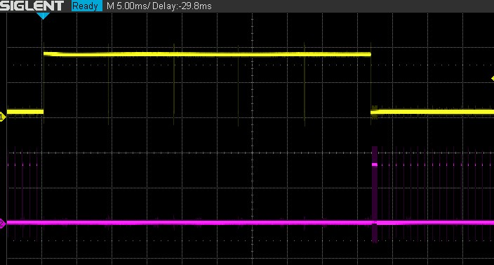

いやー長い。1行出力に10msec弱です。taskg(コンソールタスク)の優先順位を最高にしていたため、task1がRDY状態のまま待たされています。これではRDY表示になります。

長くなった原因はエミュレータ経由でコンソールに出力するところだったようです。
1文字に150usec程度かかっていました。(先頭だけは短いですが・・)  
`【2022.07.14 追記】エミュレータ出力ルーチン内でステータス待ちループしてました（考えたら70kBPS相当で1バイトずつ送り出せばそんなもんでした）`

上 TP1=990(エミュレータ経由でコンソールに1文字出力中)  
下 TP2=100(task1タスクのメインループでslp_tsk()から抜けるとパルス)  

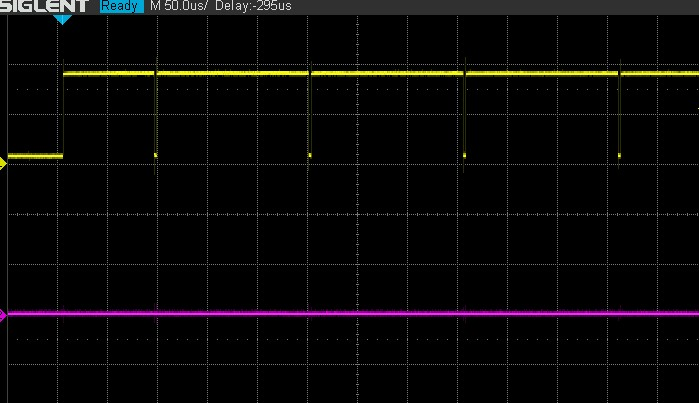

そこでコンソールタスクの優先順位を最低(8)にしました。  

```text
>task
tid= 1 taskg      RUN  pri= 8 stack=00000820(size= 1024)
tid= 2 task1      WAIT pri= 7 stack=00000C20(size=  256)
tid= 3 task2      WAIT pri= 7 stack=00000D20(size=  256)
tid= 4 task3      WAIT pri= 7 stack=00000E20(size=  256)
tid= 5 task4      WAIT pri= 7 stack=00000F20(size=  256)
```

当初の想定通り、WAITになっています。
taskコマンド表示中のtask1実行状態を確認します。

上 TP1=120(taskコマンドの1行処理ごとにON)  
下 TP2=100(task1タスクのメインループでslp_tsk()から抜けるとパルス)  

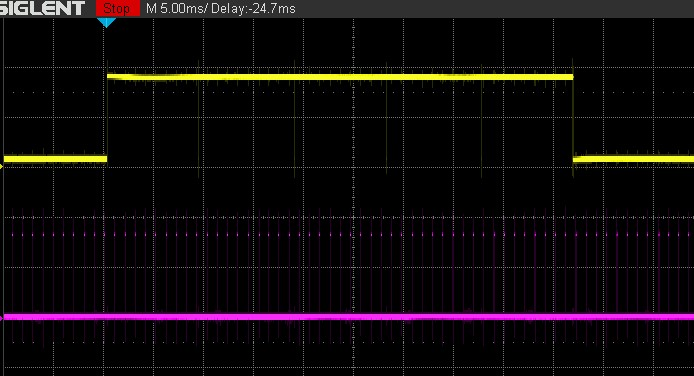

1行出力に10msec弱かかっていますが、taskg(コンソールタスク)の優先順位を最低にしたため、task1が動いています。

（この問題があってもなくても実験には影響ありません）
