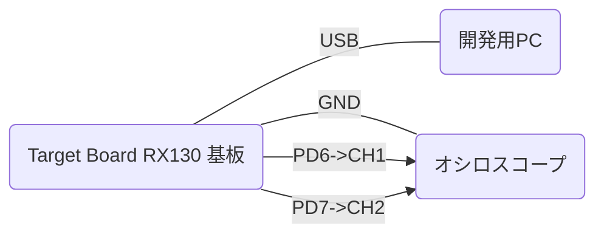

# NORTi を RX Smartconfigurator と一緒に使う方法

かふぇルネから飛んでこられた方。こんにちは、ふぐりんです。  

このドキュメントは「NORTi を RX Smartconfigurator と一緒に使う方法」の解説です。経緯については以下のかふぇルネのスレッドをご覧ください。  

* [スマートコンフィグレータの自動生成をカスタマイズしたい](https://japan.renesasrulz.com/cafe_rene/f/forum5/8248/thread)
* [MISPOさんのNORTiをRX SmartConfiguratorと一緒に使いたい場合の課題と対策を考察してみるスレッド](https://japan.renesasrulz.com/cafe_rene/f/forum21/8266/mispo-norti-rx-smartconfigurator)

<sub>【謝辞】  
NoMaYさんが発案したプログラムを中心に解説しています。NoMaYさんにあらためてお礼申し上げます。  
株式会社ミスポ様には関連コードの公開を許諾いただきました。ありがとうございました。お礼申し上げます。  
ka.makiharaさんにはNoMaYさんのプログラム作成に協力いただき、また実証実験もしていただきました。ありがとうございました。お礼申し上げます。
【お願い】  
ミスポ様にご協力いただいた情報を参考にしていますが、NoMaYさんのプログラムおよび今回の解説にミスポ様は直接関係されていません。NoMaYさんのプログラムおよび今回の解説について直接ミスポ様へ問い合わせすることはおやめください。  
【ご利用について】  
ここで解説されている情報は商用/非商用にかかわらずご利用いただけますが、何も保証しません。
</sub>

## セットアップ

1. RXシリーズの開発環境(CS+,CC-RX)でプロジェクトを作ります
2. プロジェクトにNoMaYさんの下記プログラムを追加します

* [NORTi_interrupt.c](code/NORTi_interrupt.c)
* [NORTi_interrupt.h](code/NORTi_interrupt.h)

3. NORTiを組み込みます
4. NORTiのintini()の "initialize interrupt vector table" 部分を以下と入れ替えます

```c
    /* initialize interrupt vector table (on RAM) */
#if (INTVSZ != 0)                               // NORTi管理の割込みベクタテーブルがRAMであれば普通は1024
    extern void NORTi_INT_HOOK_init(void);      // Int_Hook_Vectors[]をINTBレジスタにセット(NoMaYさん作成)
    NORTi_INT_HOOK_init();                      // 
    {
        int i;
        UW *vect = (UW *)__sectop("C$VECT");    // C$VECTセクション(CC-RXオリジナルの割り込みベクタテーブル)
        UW *hook = (UW *)get_intb();            // NORTi対応割り込みベクタテーブル(NoMaYさん作成,Int_Hook_Vectors[])
        for (i = 0; i < INTVSZ / 4; i++) {      // 割込みベクタテーブル(NORTi管理,RAM)全体にコピー
            intvec[i] = (i<16)?vect[i]:hook[i]; // 0～15は無条件トラップ専用なのでC$VECT、それ以外はInt_Hook_Vectors[]
        }
    }
#endif
```

上記でセットアップは完了です。  

## 効果

### 1. FIT/CGは改変なしでそのままNORTiを利用できます。(コールバックでNORTi利用可)

### 2. NORTiの割込みハンドラ(def_inh())をそのまま利用できます。

### 3. NORTiの割込みサービスルーチン(cre_isr())をそのまま利用できます。（最初におまじない必要）

割込みサービスルーチン(cre_isr())を使う前に、1回だけ def_inh(割り込み番号, NULL) をしてください。NULLを指定することで、その割込み番号だけNoMaYさんのInt_Hook_Vectors[]の代わりにNORTiの管理用ルーチンがセットされます。

### 4. FIT/CGの割込み処理はNORTi対応で少しオーバヘッドが増えますが、NORTiを使わないで高速に処理したい場合(nonOS)はdef_inh()で対応できます。

## 実験(Target Board for RX130,CS+)

### 使用ツールと実験プログラムについて

* [統合開発環境 CS+](https://www.renesas.com/jp/ja/software-tool/cs)
* [CC-RXコンパイラ](https://www.renesas.com/jp/ja/software-tool/cc-compiler-package-rx-family)
* [NORTi Professional](http://www.mispo.co.jp/products/NORTi/Pro/)
* [Target Board for RX130](https://www.renesas.com/jp/ja/products/microcontrollers-microprocessors/rx-32-bit-performance-efficiency-mcus/rtk5rx1300c00000br-target-board-rx130)
* [GG for CC-RX(EMU)](https://github.com/mkogax/GG_for_CCRX)

Target Board for RX130 に内蔵されたE2Lite相当エミュレータを経由したデバッグコンソールでGGコンソール機能(GG for CC-RX)を使います。  
NORTiタスクの状態表示/起動終了制御などを行うコマンドを実装しました。  

```text
** GG for CCRX **
tskpri=1
>task
tid= 1 taskg      RUN  pri= 1 stack=00000820(size= 1024)
tid= 2 task1      DMT  pri= 8 stack=00000C20(size=  256)
tid= 3 task2      DMT  pri= 8 stack=00000D20(size=  256)
tid= 4 task3      DMT  pri= 8 stack=00000E20(size=  256)
tid= 5 task4      DMT  pri= 8 stack=00000F20(size=  256)
>task ?
(usage)
task                       タスク一覧(状態表示)
task act <tid>             act_tsk(tid)
task cana <tid>            can_act(tid)
task sta <tid> [<stacd>]   sta_tsk(tid,stacd)
task ter <tid>             ter_tsk(tid)
task chg <tid> <tskpri>    chg_pri(tid,tskpri)
task ref <tid>             ref_tsk(tid,&rtsk)
task sus <tid>             sus_tsk(tid)
task rsm <tid>             rsm_tsk(tid)
task frsm <tid>            frsm_tsk(tid)
task wup <tid>             wup_tsk(tid)
task canw <tid>            can_wup(tid)
task rel <tid>             rel_wai(tid)
(tidは数値でもタスク名でも可)
>help
        help [cmd..]                  : command help
-- memory command --
          md [addr [alen]]            : mem dump
          ms addr data..              : mem set
          mf addr alen data           : mem fill
-- Example of original command registration --
       test1 [...]                    : Display command line arguments when executing this command
        task [...]                    : Display and control task status
         cmt                          : CMT(FITモジュール) NORTi用タイマ設定状態表示
-- TP command --
          tp [#1 [#2]]                : TP(test point) select
>
```

またTP機能で状態変化タイミングをオシロで観測しました。



実験時のプログラムソース(参考)

* [GG_NORTi.c](code/GG_NORTi.c)  メインプログラム
* [GG_NORTi_task.c](code/GG_NORTi_task.c)  タスク制御（GGコンソール用コマンド)
* [gg_sysdef.h](code/gg_sysdef.h)  GGコンソール設定(TP機能)

### 実験１．r_cmt_rx(FIT)の10msec周期コールバックからNORTiのチックタイム通知(isig_tim())

```c
void main(void)
{
    GG_DI_ON();     // 割込み禁止

    sysini();       // NORTi初期化

    // CMT(FITモジュール) タイマ設定(10msec周期割込み)
    R_CMT_CreatePeriodic(100, cmt_10msec_callback, &cmt_10msec_ch);

```

```text
>tp 900 30
<TP status number(The specified status number appears in TP)>
TP1 = 900 (-1=do nothing)
TP2 =  30 (-1=do nothing)
>
```

上 TP1=900(cmt_10msec_callback()処理)  
下 TP2=30(taskgタスクのメインループの10msec待ちの「出口」)  


約10msec周期でisig_tim()から約15usec後に10msec待ちが解除されています。  
(オシロの時間軸を長くして10msec周期である確認もしています)

### 実験２．TMR0(CG)で#pragma interrupt の割込みルーチンからタスク起床(wup_tsk())

```c
(Config_TMR0_user.c)

#if FAST_INTERRUPT_VECTOR == VECT_TMR0_CMIA0
#pragma interrupt r_Config_TMR0_cmia0_interrupt(vect=VECT(TMR0,CMIA0),fint)
#else
#pragma interrupt r_Config_TMR0_cmia0_interrupt(vect=VECT(TMR0,CMIA0))
#endif
static void r_Config_TMR0_cmia0_interrupt(void)
{
    /* Start user code for r_Config_TMR0_cmia0_interrupt. Do not edit comment generated here */
    extern void task1_TMR0_callback(void);
    task1_TMR0_callback();
    /* End user code. Do not edit comment generated here */
}
```

```text
>task sta task1
sta_tsk(2,0) = 0
>
** task1 ** stacd=0, tskpri=8
#pragma interruptによるFIT/CG割り込みルーチンの実験--
R_Config_TMR0_Start()
>task
tid= 1 taskg      RUN  pri= 1 stack=00000820(size= 1024)
tid= 2 task1      RDY  pri= 8 stack=00000C20(size=  256)
tid= 3 task2      DMT  pri= 8 stack=00000D20(size=  256)
tid= 4 task3      DMT  pri= 8 stack=00000E20(size=  256)
tid= 5 task4      DMT  pri= 8 stack=00000F20(size=  256)
>tp 101 100
<TP status number(The specified status number appears in TP)>
TP1 = 101 (-1=do nothing)
TP2 = 100 (-1=do nothing)
>
```

上 TP1=101(task1_TMR0_callback()処理)  
下 TP2=100(task1タスクのメインループでslp_tsk()から抜けるとパルス)  


task1_TMR0_callback()処理はタスク名文字列でタスクIDの検索をしているので時間がかかっているようです。(約30usec)  
wup_tsk()から5.9usec後にslp_tsk()が解除されています。  

### 実験３．TMR1(CG)の改造でdef_inh() のNORTi割込みハンドラからタスク起床(wup_tsk())

```c
(Config_TMR1_user.c)

#if FAST_INTERRUPT_VECTOR == VECT_TMR1_CMIA1
#pragma interrupt r_Config_TMR1_cmia1_interrupt(vect=VECT(TMR1,CMIA1),fint)
#else
#pragma interrupt r_Config_TMR1_cmia1_interrupt(vect=VECT(TMR1,CMIA1))
#endif
static void r_Config_TMR1_cmia1_interrupt(void)
{
    /* Start user code for r_Config_TMR1_cmia1_interrupt. Do not edit comment generated here */
    /* End user code. Do not edit comment generated here */
}

/* Start user code for adding. Do not edit comment generated here */
#include "kernel.h"
static void NORTi_r_Config_TMR1_cmia1_interrupt(void)
{
    ent_int();                                  /* enter into interrupt handler */
    extern void task2_TMR1_callback(void);
    task2_TMR1_callback();                      /* call interrupt handler body */
    ret_int();                                  /* return from interrupt handler */
}
void norti_TMR1_def_inh(void)   // TMR1の割込み処理の登録(def_inh())
{
    static T_DINH dinh = { TA_HLNG, NORTi_r_Config_TMR1_cmia1_interrupt, 6 }; // とりあえず割込レベルは６(たぶんこの割込レベルは使ってない)
    def_inh(VECT(TMR1,CMIA1), &dinh);
}
/* End user code. Do not edit comment generated here */
```

```text
>task sta task2
sta_tsk(3,0) = 0
>
** task2 ** stacd=0, tskpri=8
def_inh()によるNORTi標準割り込みルーチンの実験--
norti_TMR1_def_inh()
R_Config_TMR1_Start()

>tp 201 200
<TP status number(The specified status number appears in TP)>
TP1 = 201 (-1=do nothing)
TP2 = 200 (-1=do nothing)
>
```

上 TP1=201(task2_TMR1_callback()処理)  
下 TP2=200(task2タスクのメインループでslp_tsk()から抜けるとパルス)  


task2_TMR1_callback()処理もタスク名文字列でタスクIDの検索をしているので時間がかかっているようです。(約40usec)  
wup_tsk()から5.5usec後にslp_tsk()が解除されています。  

### 実験４．TMR2(CG)の改造でcre_isr() のNORTi割込みサービスルーチンからタスク起床(wup_tsk())

```c
(Config_TMR2_user.c)

#if FAST_INTERRUPT_VECTOR == VECT_TMR2_CMIA2
#pragma interrupt r_Config_TMR2_cmia2_interrupt(vect=VECT(TMR2,CMIA2),fint)
#else
#pragma interrupt r_Config_TMR2_cmia2_interrupt(vect=VECT(TMR2,CMIA2))
#endif
static void r_Config_TMR2_cmia2_interrupt(void)
{
    /* Start user code for r_Config_TMR2_cmia2_interrupt. Do not edit comment generated here */
    /* End user code. Do not edit comment generated here */
}

/* Start user code for adding. Do not edit comment generated here */
#include "kernel.h"
void norti_TMR2_cre_isr(void)      // TMR2の割込みサービスルーチンの登録(cre_isr())
{
    extern void task3_TMR2_callback(void);
    extern void task3_TMR2_callback2(void);
    static T_CISR cisr = { TA_HLNG, NULL, VECT(TMR2,CMIA2), task3_TMR2_callback, 6}; // とりあえず割込レベルは６(たぶんこの割込レベルは使ってない)
    static T_CISR cisr2= { TA_HLNG, NULL, VECT(TMR2,CMIA2), task3_TMR2_callback2, 6}; // とりあえず割込レベルは６(たぶんこの割込レベルは使ってない)
    def_inh(VECT(TMR2,CMIA2), NULL);    // 登録をデフォルトに再設定(_kernel_interr())  --> これでcre_isrが使える
    cre_isr(0, &cisr);                  // 割込みサービスルーチンの登録
    cre_isr(0, &cisr2);                 // 割込みサービスルーチンの登録2(多重できるか？)
}
/* End user code. Do not edit comment generated here */
```

```text
>task sta task3
sta_tsk(4,0) = 0
>
** task3 ** stacd=0, tskpri=8
cre_isr()によるNORTi標準割り込みサービスルーチンの実験--
norti_TMR2_cre_isr()
R_Config_TMR2_Start()

>tp 301 302
<TP status number(The specified status number appears in TP)>
TP1 = 301 (-1=do nothing)
TP2 = 302 (-1=do nothing)
>
```

上 TP1=301(task3_TMR2_callback()処理)  
下 TP2=302(task3_TMR2_callback2()処理)  


1回の割り込みで2つのサービスルーチンがコールされるようセットしています。
task3_TMR2_callback()処理は約50usec、task3_TMR2_callback2()処理は約40usecかかっています。検索タスク名の違いが処理時間に関係していることが分かります。  
task3_TMR2_callback()処理はtask3をwup_tsk()し、task3_TMR2_callback2()処理はtask2をwup_tsk()します。

```text
>tp 301 300
<TP status number(The specified status number appears in TP)>
TP1 = 301 (-1=do nothing)
TP2 = 300 (-1=do nothing)
```

上 TP1=301(task3_TMR2_callback()処理 task3をwup_tsk())  
下 TP2=300(task3タスクのメインループでslp_tsk()から抜けるとパルス)  


task3_TMR2_callback2()処理のぶん遅れるので、wup_tsk()から47.6usec後にslp_tsk()が解除されています。  

```text
>tp 302 200
<TP status number(The specified status number appears in TP)>
TP1 = 302 (-1=do nothing)
TP2 = 200 (-1=do nothing)
```

上 TP1=302(task3_TMR2_callback2()処理 task2をwup_tsk())  
下 TP2=200(task2タスクのメインループでslp_tsk()から抜けるとパルス)  


task3_TMR2_callback2()処理のwup_tsk()から26.6usec後にslp_tsk()が解除されています。この遅れ時間は、その直前にtask3のslp_tsk()が先に解除されふたたびtask3がslp_tsk()になるまで待たされたためだと思われます。

```text
>tp 300 200
<TP status number(The specified status number appears in TP)>
TP1 = 300 (-1=do nothing)
TP2 = 200 (-1=do nothing)
```

上 TP1=300(task3タスクのメインループでslp_tsk()から抜けるとパルス)  
下 TP2=200(task2タスクのメインループでslp_tsk()から抜けるとパルス)  


確認してみると、やはりtask3のlp_tsk()が解除されふたたびtask3がslp_tsk()になってから8.2usec後にtask2のslp_tsk()が解除されています。

### 実験５．TMR3(CG)で#pragma interrupt の割込みルーチンを非NORTiとして再登録(def_inh())してカウンタ変数更新を確認

```c
(Config_TMR3_user.c)

#if FAST_INTERRUPT_VECTOR == VECT_TMR3_CMIA3
#pragma interrupt r_Config_TMR3_cmia3_interrupt(vect=VECT(TMR3,CMIA3),fint)
#else
#pragma interrupt r_Config_TMR3_cmia3_interrupt(vect=VECT(TMR3,CMIA3))
#endif
static void r_Config_TMR3_cmia3_interrupt(void)
{
    /* Start user code for r_Config_TMR3_cmia3_interrupt. Do not edit comment generated here */
    extern void task4_TMR3_callback(void);  // NORTi非対応
    task4_TMR3_callback();  // NORTi非対応
    /* End user code. Do not edit comment generated here */
}

/* Start user code for adding. Do not edit comment generated here */
#include "kernel.h"
void nonOS_TMR3_def_inh(void)      // TMR2の非NORTi割込みの登録(def_inh())
{
    static T_DINH dinh = { TA_HLNG, r_Config_TMR3_cmia3_interrupt, 6 }; // とりあえず割込レベルは６(たぶんこの割込レベルは使ってない)
    def_inh(VECT(TMR3,CMIA3), &dinh);
}
/* End user code. Do not edit comment generated here */
```

```text
>task sta task4
sta_tsk(5,0) = 0
>
** task4 ** stacd=0, tskpri=8
非NORTi割り込みによるコールバックの実験--
nonOS_TMR3_def_inh()
R_Config_TMR3_Start()

>tp 401 400
<TP status number(The specified status number appears in TP)>
TP1 = 401 (-1=do nothing)
TP2 = 400 (-1=do nothing)
>
```

上 TP1=401(task4_TMR3_callback()処理)  
下 TP2=400(task4タスクのメインループでtask4_counterの変化を検出するとパルス)  

https://user-images.githubusercontent.com/11693904/178516010-ede07447-d9a4-41cc-be2b-f0aa140e5023.mp4

task4_TMR3_callback()は8bitタイマを使用してきっちりmsec単位ではありません。一方、task4では10msecごとにtask4_counterをチェックするのでtask4_TMR3_callback()のタイミングと微妙にずれていきます。
動画ではtask4でtask4_counterの変化を検出するタイミングがずれていく様子が分かります。
(下は残像のためか2パルスに見えるときがありますが、本当は1パルスのみです)
