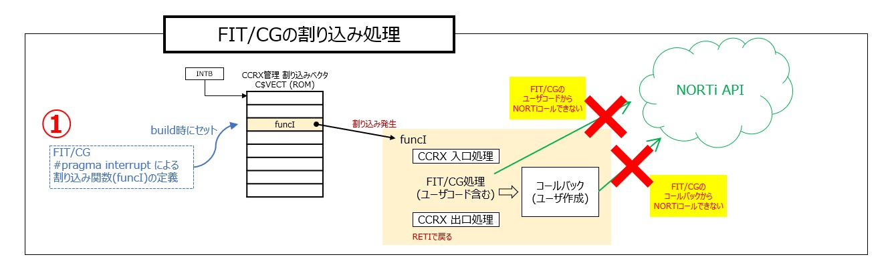
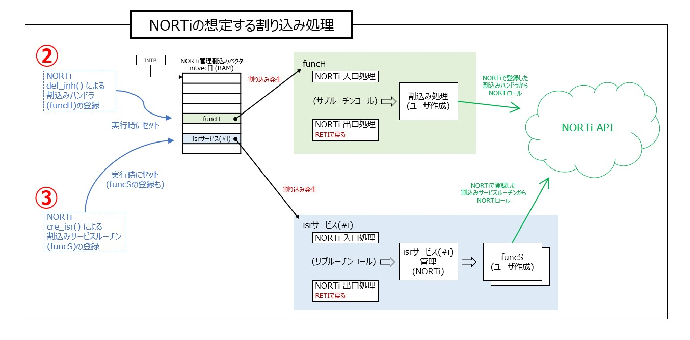
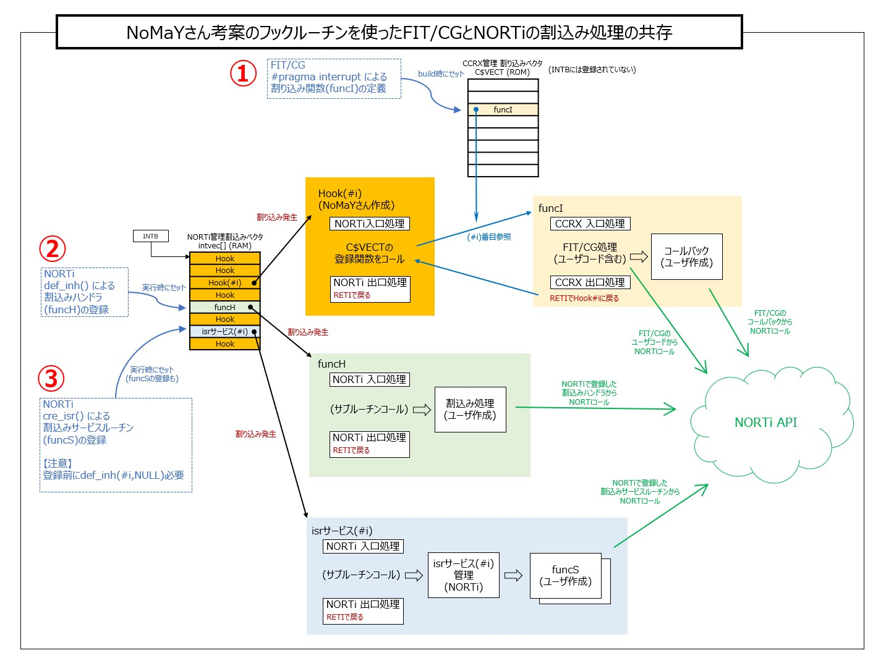

# NORTi を RX Smartconfigurator と一緒に使う方法(動作の解説)

## 動作の解説

NoMaYさん考案のフックルーチンが肝です。このフックルーチンによって、FIT/CGの自動生成コードのなか（ユーザコードやコールバック）からNORTiのAPIを呼び出すことができるようになりました。

### これまで（NoMaYさん考案前）

FIT/CGで自動生成される割込み処理そのままだとNORTiのAPIを呼び出すことができません。
また③を使うためには、NORTi管理の割込みベクタ（RAM）を使わなければなりません。  
FIT/CGでNORTiを使えるようにするための様々なアプローチがありましたが・・

1. 作りこみが面倒
2. 再度自動生成するときに壊れてしまう
3. 自動生成が反映されなくなる

といった問題がありました。

### これから（NoMaYさん考案のフックルーチンがある）

NoMaYさん考案のフックルーチンは、FIT/CGの割込み処理の前に潜り込んで、NORTiの割込みハンドラと同じように「NORTi入口処理」と「NORTi出口処理」を実行します。  
その間で本来のFIT/CGの割込み処理をコールするのですが、そのとき割り込みが発生した風を装って（スタックにPCとPSWを積んで）コールすることでRETI命令で戻ってこられるようにしています。
