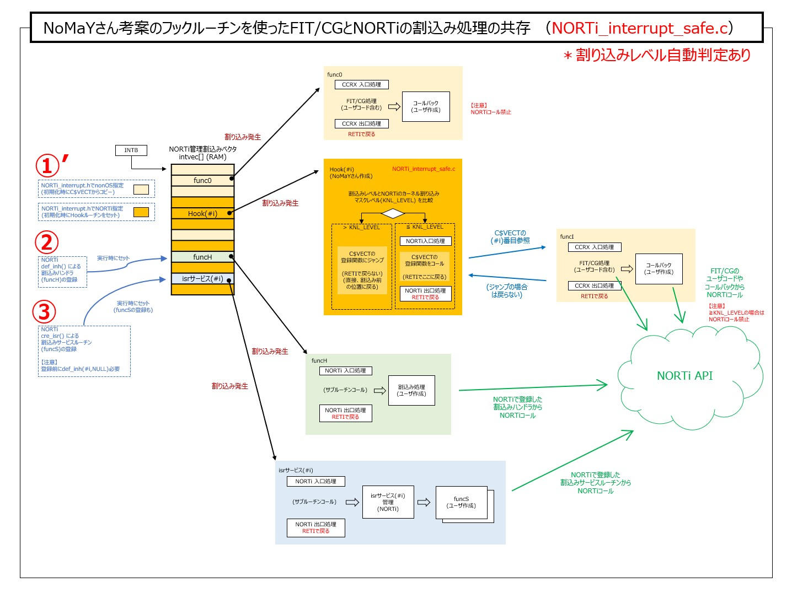

# NORTi を RX Smartconfigurator と一緒に使う方法(動作の解説)

## 動作の解説

NoMaYさん考案のフックルーチンが肝です。このフックルーチンによって、FIT/CGの自動生成コードのなか（ユーザコードやコールバック）からNORTiのAPIを呼び出すことができるようになりました。  

[（解説図の原本はこちら）](image/NORTiとFITの同居解説_20230505.pdf)

### これまで（NoMaYさん考案前）

FIT/CGで自動生成される割り込み処理そのままだとNORTiのAPIを呼び出すことができません。  
また③を使うためには、NORTi管理の割り込みベクタ（RAM）を使わなければなりません。  
FIT/CGでNORTiを使えるようにするための様々なアプローチがありましたが・・

1. 作りこみが面倒
2. 再度自動生成するときに壊れてしまう
3. 自動生成が反映されなくなる

といった問題がありました。

### これから（NoMaYさん考案のフックルーチンがある）

NoMaYさん考案のフックルーチンは、FIT/CGの割り込み処理の前に潜り込んで、NORTiの割り込みハンドラと同じように「NORTi入口処理」と「NORTi出口処理」を実行します。  
その間で本来のFIT/CGの割り込み処理をコールするのですが、そのとき割り込みが発生した風を装って（スタックにPCとPSWを積んで）コールすることでRETI命令で戻ってこられるようになっています。

  

### 割り込みレベル自動判定【2023.05.05 追記】

私の環境で、あるとき思いがけず発生したBUSERR割込みで暴走するという問題が発生しました。不用意にBUSERR割込みを有効にしていた私が悪いのですが・・  
原因はBUSERRの割り込みレベルがNORTiのカーネル割り込みマスクレベル(KNL_LEBEL)をこえていて、なおかつBUSERRは割り込み処理ルーチン内で割込み要因をクリアするので「NORTi 入口処理」の時点で割り込みが要因がON状態だったためでした。私は、NORTi_interrupt.hでNORTiを使わない割り込みは「nonOS」設定にすることで対策しました。  

この話を見たNoMaYさんが対策版のNORTi_interrupt.cをつくってくれました。これをNORTi_interrupt_safe.cとして置いています。  
NORTi_interrupt.cの代わりにNORTi_interrupt_safe.cを使うと、割り込み発生時の割り込みレベルがNORTiのカーネル割り込みマスクレベル(KNL_LEBEL)をこえているとき、「NORTi入口処理」と「NORTi出口処理」は実行されません。(下図参照)  

  

### 割り込みレベル自動判定 有/無 のどちらを使うべきか

FITなど自動生成を使うと割り込みに無頓着になりやすいので、安全のために「割り込みレベル自動判定あり(NORTi_interrupt_safe.c)」を使う考え方もありますが、もし割り込みレベルが高すぎて「NORTi入口処理」が呼ばれてなければ、そのユーザコードやコールバックでNORTiのAPIを呼ぶことはできません。（呼べばトラブルが発生する）  

結局、NORTiのAPI呼出をする予定の割り込み全てを把握し管理できてなければなりません。  
それができていれば自動判定は必要ありません。  
0.1usec単位で応答時間を気にするのであれば自動判定なし(NORTi_interrupt.c)を推奨します。（README.mdの応答時間参照）
